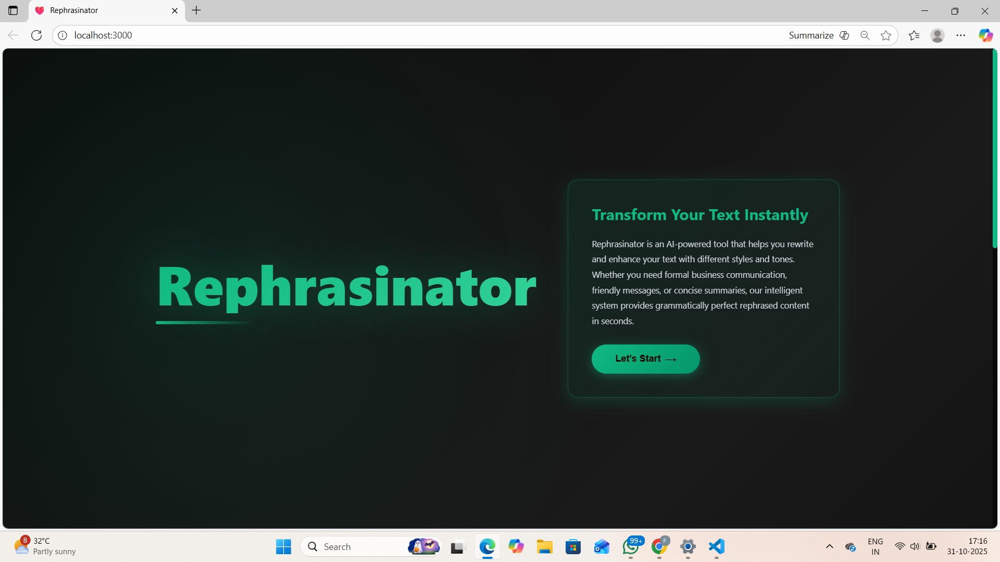
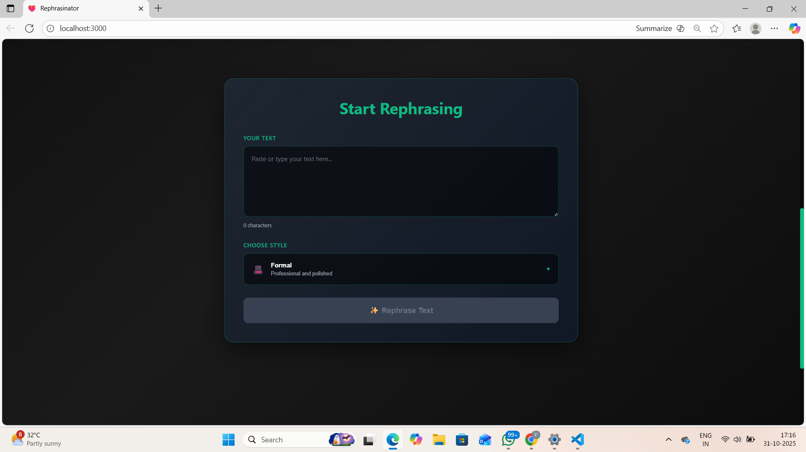

# 🪄 Rephrasinator

**Rephrasinator** is an intelligent NLP-powered **text rephrasing and grammar enhancement tool** that helps users rewrite sentences in different tones (formal, casual, polite, etc.) with proper grammar correction.  
It leverages **Transformers (T5-base)** for high-quality rephrasing and tone control, along with a **FastAPI backend** and a **React.js + CSS frontend** for a modern, responsive user interface.

---

## 🚀 Features

- ✍️ **Smart Rephrasing:** Rewrites user input while preserving meaning and improving clarity.  
- 🎭 **Tone Control:** Allows users to choose tones such as *formal*, *casual*, or *polite*.  
- ✅ **Grammar Correction:** Automatically fixes grammatical errors using transformer-based grammar models.  
- ⚙️ **FastAPI Backend:** Handles NLP model inference and serves rephrasing & correction APIs.  
- 💻 **React.js Frontend:** Beautifully designed UI for real-time rephrasing and feedback.  
- 🌐 **Full Integration:** End-to-end communication between React frontend and FastAPI backend.  

---

## 🧩 Tech Stack

### **Frontend**
- React.js  
- CSS  
- Axios (for API calls)

### **Backend**
- FastAPI  
- PyTorch  
- Transformers (Hugging Face – T5-base)  
- NLTK  

### **Development Tools**
- Python 3.10+  
- Node.js & npm  
- Git / GitHub  

---

## 📁 Folder Structure
```
Rephrasinator/
│
├── backend/
│ ├── api/
│ │ └── app.py # FastAPI app with /rephrase, /grammar, /smart_rephrase routes
│ ├── src/
│ │ ├── rephraser.py # Core text rephrasing and tone control logic
│ │ ├── grammar_corrector.py # Grammar correction using T5-base
│ │ ├── tone_classifier.py # Calculates tone similarity scores
│ │ └── preprocessing.py # Text preprocessing (lemmatization, stopwords removal, etc.)
│ └── models/ # Model files (if locally stored)
│
├── frontend/
│ ├── src/
│ │ ├── components/
│ │ │ ├── RephraserForm.jsx
│ │ │ ├── Header.jsx
│ │ │ └── Footer.jsx
│ │ ├── App.js
│ │ └── index.js
│ ├── public/
│ └── package.json
│
├── .gitignore
└── README.md
```

---

## ⚙️ Setup Instructions

### **Backend Setup**
1. Create and activate a virtual environment:
   ```bash
   python -m venv venv
   venv\Scripts\activate   # Windows
   source venv/bin/activate  # macOS/Linux

2. Install dependencies:
    ```bash
    pip install -r requirements.txt

3. Run FastAPI server:
    ```bash
    uvicorn backend.api.app:app --reload

### **Frontend Setup**
1. Move to frontend directory:
    ```bash
    cd frontend

2. Install React dependencies:
    ```bash
    npm install

3. Run React app:
    ```bash
    npm start

4. Open browser and visit:
👉 http://localhost:3000

## 🖥️ Project Preview

### 🔹 Web Interface


### 🔹 Form Page


## **🧠 Model Details**

- Model Used: T5-base
- Purpose: Text rephrasing, tone adaptation, and grammar correction
- Libraries: transformers, torch, nltk

## **🧪 API Endpoints**
Endpoint	Method	Description
/rephrase	POST	Returns rephrased text
/grammar	POST	Returns grammatically corrected text
/smart_rephrase	POST	Combines tone control + grammar correction

## **💡 Future Enhancements**

- Add multilingual support (English → other languages)
- Improve tone classification using BERT
- Deploy backend on AWS Lambda / Render
- Host frontend on Vercel or Netlify

## **👨‍💻 Author**

Fellah Faizel
Computer Science Engineer | AI & NLP Enthusiast
📧 [faizelfellah@gmail.com]

## **🪶 License**

This project is licensed under the MIT License – feel free to use and modify it with attribution.


---
